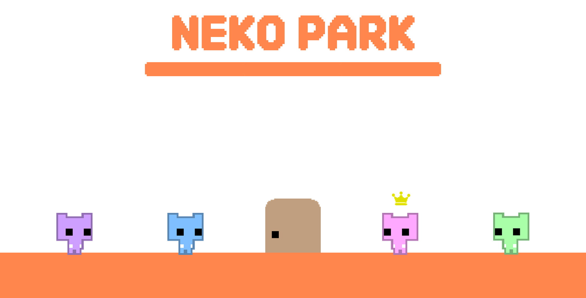

<h1 align="middle">NEKO PARK</h1>
 
 

# 1. Project Overview (프로젝트 개요)
<h3>Unity 2D Team Project - PICO PARK 모작</h3>
<h4>[온라인 네트워크 협동 게임]</h4>
<h3>2024.8.12 - 2024.8.19(3일)</h3>

 

# 2. Team Members (팀원 및 팀 소개)
| 전홍현 | 박지훈 | 김수진 | 김수주 |
|:---:|:---:|:---:|:---:|
|  |  |  |  |
|  |  |  |  |
| [GitHub](https://github.com/Yogurtsharbet) | [GitHub](https://github.com/enterpd20) | [GitHub](https://github.com/Nuuuing) | [GitHub](https://github.com/sjkim9717) |

 
 

# 3. Key Features (주요 기능)
## 3.1 System
  - 저장
    - 싱글모드 저장
    - 멀티모드 저장
    - 카메라 이동
    - 마우스 입력

## 3.2 플레이어
  - 플레이어 이동 및 점프
  - 애니메이션
  - 오브젝트 상호작용
  
## 3.3 오브젝트
  - 열쇠
  - 문
  - 박스
  - 바닥 블럭

## 3.4  Network
### 3.4.1 TCP
  - 로비 - 방 목록
    - 방 만들기
    - 방 접속

### 3.4.2 Mirror
  - 플레이어 위치연동
  - 플레이어 별 컬러 연동
  - 플레이어 애니메이션 연동

# 4. Technology Stack (기술 스택)
 

|  |  |  |
|:---:|:---:|:---:|
| Unity |  | 2020.3.36f1 |
